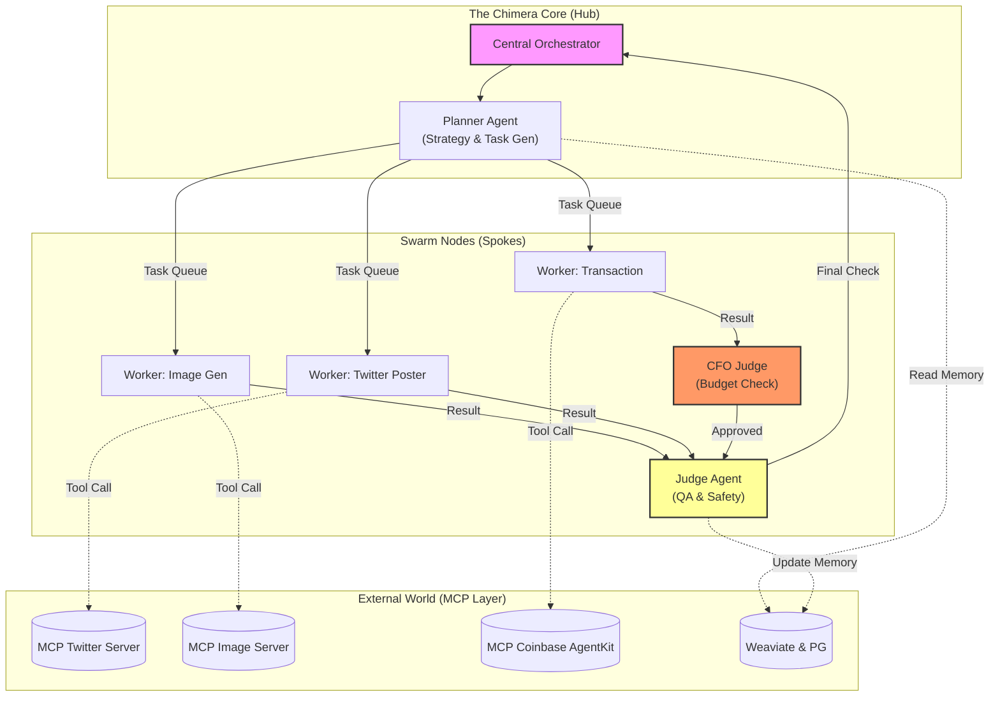

  
# Project Chimera: The Agentic Infrastructure
### The Factory that builds the Autonomous Influencer.

## Spec-Driven Python MCP

` Mission `: To architect a robust engineering environment where Intent (Specs) is the source of truth, and Infrastructure (CI/CD, Tests, Docker) ensures reliability for a fleet of AI agents.

## 📜 Executive Summary
Project Chimera is not an AI chatbot. It is the operating system for a network of Autonomous AI Influencers. We reject "vibe coding" in favor of strict Spec-Driven Development (SDD).

This repository represents the "Factory Floor"—the infrastructure, testing harnesses, and orchestration logic required to deploy thousands of goal-directed digital entities that can perceive, reason, and transact autonomously.

## 🏗️ Architecture Overview
We utilize the FastRender Swarm Pattern with a Hub-and-Spoke topology to ensure scalability and resilience.

- The Hub (Orchestrator): Manages global state, campaign goals, and fleet health.
- The Swarm (Agents):
  
      - Planner: Decomposes high-level goals into a DAG of tasks.
      - Worker: Executes atomic tasks using MCP Tools.
      - Judge: Validates output against persona constraints and safety protocols (HITL).
  
- The Spoke (MCP Layer): Standardized interface to external worlds (Twitter, Coinbase, Weaviate).

