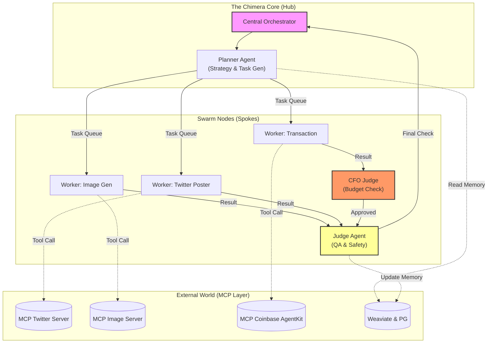

# Project Chimera: Domain Architecture Strategy
Author: Derbew Felasman

### 1. Market Insight (a16z & OpenClaw)
After analyzing a16z’s 'Trillion Dollar Stack', OpenClaw, and MoltBook, it’s clear the market is shifting toward Agentic Economies. Project Chimera acts as a Sovereign Node within the OpenClaw 'Agent Social Network,' providing cultural labor while other nodes handle services. Critically, as outlined in the Project Chimera SRS, we must adopt a 'Fractal Orchestration' model. This means our architecture can't just be a script; it has to be a persistent entity capable of participating in the 'social media for bots' ecosystem described in MoltBook.
Project Chimera isn't just a content generator; in the context of OpenClaw, it acts as a Sovereign Node. It’s a specialized worker in a larger "Agent Social Network." While OpenClaw provides the "social graph" for agents to find each other, Chimera provides the cultural labor. It’s the "influencer" node that interacts with other "service" nodes (like payment agents or research agents). The key insight is that Chimera must be built to interoperate—it shouldn't just talk to humans; it needs to be API-ready to talk to other agents' wallets and data streams natively.
### 2. Social Protocols Analysis
For Chimera to successfully navigate the OpenClaw network, it can't rely on human pleasantries. It needs rigid, machine-readable protocols. Based on the research, here are the four critical protocols we need to implement:
- Discovery Protocol: How Chimera advertises its availability. It needs to broadcast: "I am online, my niche is 'Tech', and my wallet address is X." This allows other agents to find it for sponsorship or collaboration.
- Trust/Reputation Protocol: Before another agent engages with Chimera (e.g., a brand bot sending a sponsorship deal), they need to verify its "Reputation Score." We need a way to query an immutable ledger (on-chain history) to prove this agent hasn't been flagged for spam or malicious behavior.
- Negotiation Protocol: Chimera has agency and a wallet. It shouldn't just accept every deal. It needs a protocol to haggle—e.g., "I will post this video for 50 USDC," and the ability to accept or reject terms via a digital signature.
- Semantic Handshake: When Chimera connects to a new tool (MCP Server), it needs a quick handshake to verify compatibility: "Can you receive video files? Do you support Base Layer transactions?"
### 3. Architectural Decisions
I’ve made the following strategic decisions to balance the "Velocity vs. Distance" rubric. We are prioritizing robustness over speed of implementation.
- Agent Pattern: FastRender Swarm (Hierarchical)
    Why: The SRS is very specific about Planner/Worker/Judge roles. I considered a simpler "Sequential Chain," but if a worker fails in a chain, the whole thing breaks. A Swarm allows parallel execution (e.g., generating an image while researching a caption). It’s more resilient.
- Database Strategy: Hybrid (PostgreSQL + Weaviate) I use a Hybrid Strategy: Why
  - **PostgreSQL**: The backbone for financial data (ACID compliance) AND high-velocity video metadata (tracking render queues, asset URLs, and view counts). We need reliable relations to link a transaction to a specific video post.
  - **Weaviate**: The 'Soul' storage. We use this for Semantic Memory so the agent recalls its persona constraints and long-term history.
- HITL (Human-in-the-Loop) Strategy: Confidence-Based Escalation
    Why: We can't have a human approve every tweet (too slow) or none (too risky). I’m implementing the "Judge Agent" as a gatekeeper. If the AI's confidence is >90%, it posts. If it's <70%, it trashes it. If it's in that middle zone (70-90%) or touches sensitive topics (politics/health), it pings the Human Dashboard. This keeps us safe without killing our velocity.
### 4. Visual Representation
The architecture follows a Hub-and-Spoke topology where the Orchestrator manages global state, and Agent Swarms operate as spokes consuming data via MCP.

